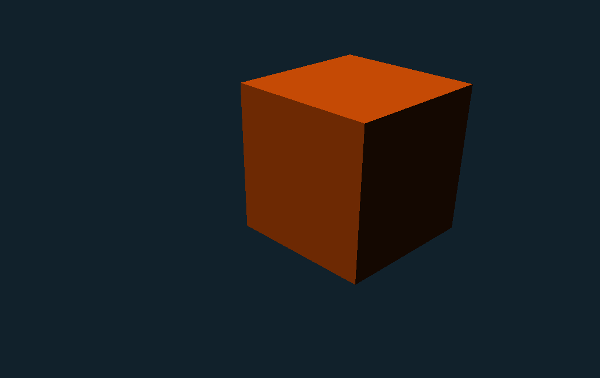

# D&D Creator - An engine for D&D Campaigns

> [!NOTE]
> This screenshot of D&D Creator's rendering system is extremely early into the project.
> The image is subjected to change in the near future once systems are actually applied and
> visuals get an upgrade.

# Table of Contents
- [Overview](#overview)
- [Tech Stack](#tech-stack)
- [Current State](#current-state)
- [Future Plans](#future-plans)

## Overview
D&D Creator is a 3D engine specifically created to make D&D Campaigns. The main goal of the project is to bridge the tediousness of building a campaign into an all-encompassing engine that not only simplifies the development of campaign creation through it's editors, but also starting and playing campaigns through the software's `Campaign Mode`.

## Tech Stack
D&D Creator is a project built in C++20, it uses GLFW and OpenGL for its graphics pipeline and ***currently*** ImGui for the UI.

## Current State
D&D Creator is in its ***very*** early stages of development. The engine is currently just starting to take shape and functionality is still sparse. The focus at the moment is the architecture for future scalable code, so many systems are currently very early, unfinished, or unimplemented.
 
## Future Plans
D&D Creator is planned to ship with two core modes:

**Editor Mode** — A suite of editors for building campaigns from scratch:
- **Map Editor** — 3D map creation with object placement, terrain sculpting, and asset management
- **Model Editor** — Custom model creation and importing for campaign assets
- **Character Editor** — Character sheet creation and management
- **Campaign Editor** — Stitch maps, characters, and rules into a playable campaign

**Campaign Mode** — A full in-engine experience for running and playing campaigns:
- **Quick Play Dashboard** — Jump into existing campaigns quickly
- **Create Campaign** — Set up a new campaign session
- **Multiplayer** — Invite players to join campaigns online

The long term goal is for D&D Creator to be a fully self-contained tool From building the world to playing in it.